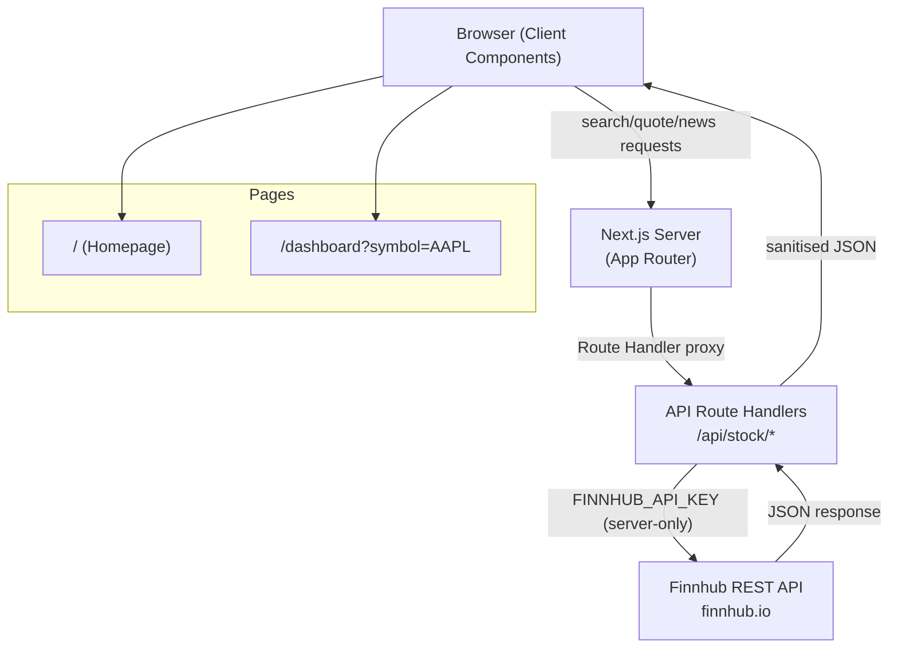

# Claude Stocks App — Architecture Plan

## Overview

Claude Stocks App is a professional stock market dashboard built on Deno, Next.js (App Router), and TypeScript. Users search for a company by name or ticker, select it from a live results list, and land on a dashboard displaying the current stock price, a Chart.js historical price chart, and a company news feed. The company can be changed at any time via a dropdown without leaving the dashboard.

The application is intentionally minimal: no authentication, no persistent storage, no mobile support. All complexity lives in clean data-fetching patterns, a well-structured component tree, and a secure server-side proxy for the stock API.

---

## Goals & Success Criteria

- A user can open the homepage and see the title, a search bar, and a footer.
- Typing a company name or ticker symbol into the search bar returns live results within 500 ms (debounced).
- Selecting a result navigates to the dashboard, which is populated with current price, historical price chart (90-day default), and a news feed of the last 10 articles.
- The historical chart time range can be switched between 1M, 3M, and 1Y without a full page reload.
- The company dropdown on the dashboard replaces all three data panels without a full page reload.
- `PriceHeader` displays a "Market closed" badge when Finnhub returns a stale (non-real-time) price outside market hours.
- All API failure states surface a Shadcn `Alert` component with a clear, neutral message.
- No API key is ever exposed to the browser — all external requests are proxied through Next.js Route Handlers.
- The application passes all three Playwright E2E flows: homepage render, search, and dashboard population.
- All unit-testable utilities are covered by `deno test`.
- The project builds successfully with `deno task build` and starts with `deno task dev`.

---

## Constraints & Assumptions

- **Runtime**: Deno 2.x (npm compatibility mode enabled — no Node.js shims required).
- **Framework**: Next.js 15 (App Router only; no Pages Router).
- **Language**: TypeScript in strict mode throughout.
- **Styling**: Tailwind CSS v4 with `@import "tailwindcss"` and `@theme {}` pattern (no `tailwind.config.js`).
- **UI Components**: Shadcn (used for structural components — Input, Card, Select, Skeleton loaders, Alert).
- **Charting**: Chart.js via `react-chartjs-2` (dynamic import required to prevent SSR errors).
- **API**: Finnhub free tier (see API selection rationale below).
- **Stock universe**: US-listed stocks only. Finnhub free-tier coverage of non-US exchanges is unreliable and may return `s: "no_data"` for candle requests. International symbol support is a planned future feature.
- **Desktop only**: No responsive breakpoints below 1024 px.
- **Typography**: DM Sans (Google Font, loaded via `next/font/google` and self-hosted by Next.js). See Typography section below.
- **No database**: All data is fetched live on demand; no caching layer beyond Next.js `fetch` revalidation.
- **API key**: Stored in `.env.local`, never committed, never sent to the client.

---

## Stock API Selection — Finnhub (Free Tier)

### Candidates Evaluated

| API | Free tier | Symbol search | Quote | Historical candles | Company news | Notes |
|---|---|---|---|---|---|---|
| **Finnhub** | Yes | Yes | Yes | Yes (daily) | Yes | No CORS issues; token in header or query param |
| Alpha Vantage | Yes | Yes | Yes | Yes | No | 25 req/day on free tier — too restrictive |
| Yahoo Finance (unofficial) | N/A | Scraping | Scraping | Scraping | Scraping | No official API; brittle; ToS risk |
| Polygon.io free | Yes | Yes | Yes | Previous close only | No | Historical data requires paid plan |
| Twelve Data | Yes | Yes | Yes | Limited | No | 8 req/min free; limited history |

### Recommendation: Finnhub

**Rationale**:

1. **Free tier is genuinely usable**: 60 API calls/minute on the free tier covers all three data needs (search, quote, candles, news) within a single dashboard load.
2. **All required endpoints exist on the free tier**:
   - `GET /search?q={query}` — symbol/company search.
   - `GET /quote?symbol={symbol}` — real-time quote (current price, change, % change).
   - `GET /stock/candle?symbol={symbol}&resolution=D&from={unix}&to={unix}` — daily OHLCV candles for the chart.
   - `GET /company-news?symbol={symbol}&from={date}&to={date}` — news articles.
3. **Clean REST API**: Token passed as `?token=` query param or `X-Finnhub-Token` header. The header approach keeps it off the URL and out of access logs when called server-side.
4. **Reliable documentation**: Confirmed via context7 (`/websites/finnhub_io_api`).

**Registration**: A free API key is obtained at `https://finnhub.io/register`. Store as `FINNHUB_API_KEY` in `.env.local`.

**Rate-limit strategy**: The Next.js Route Handlers act as the single point of egress. A server-side in-memory cache (using a module-scoped `Map`) will hold responses for 60 seconds for quotes and candles, and 5 minutes for news, keeping well within the 60 req/min ceiling during normal use.

---

## High-Level Architecture



**Key principle**: The browser never holds or requests the Finnhub API key. Every external call goes through a Next.js Route Handler on the server. The client only calls `/api/stock/*` endpoints on the same origin.

---

## Project Scaffolding

### Folder Structure

```
claude-stocks-app/
├── app/                          # Next.js App Router root
│   ├── layout.tsx                # Root layout (DM Sans font, Tailwind base, metadata)
│   ├── page.tsx                  # Homepage — search bar + title + footer
│   ├── dashboard/
│   │   └── page.tsx              # Dashboard page — price, chart, news
│   └── api/
│       └── stock/
│           ├── search/
│           │   └── route.ts      # GET /api/stock/search?q=
│           ├── quote/
│           │   └── route.ts      # GET /api/stock/quote?symbol=
│           ├── candles/
│           │   └── route.ts      # GET /api/stock/candles?symbol=&from=&to=
│           └── news/
│               └── route.ts      # GET /api/stock/news?symbol=
├── components/
│   ├── ui/                       # Shadcn primitives (auto-generated)
│   ├── search/
│   │   ├── SearchBar.tsx         # Controlled input with debounce
│   │   └── SearchResults.tsx     # Dropdown list of symbol results
│   ├── dashboard/
│   │   ├── PriceHeader.tsx       # Current price + change banner + market status badge
│   │   ├── StockChart.tsx        # Chart.js line chart (dynamic import)
│   │   ├── NewsFeed.tsx          # Scrollable news article list
│   │   └── CompanySelector.tsx   # Shadcn Select for switching companies
│   └── layout/
│       ├── Header.tsx            # App header (logo / title)
│       └── Footer.tsx            # Footer
├── lib/
│   ├── finnhub/
│   │   ├── client.ts             # Typed fetch wrapper for Finnhub endpoints
│   │   └── types.ts              # TypeScript interfaces for all API responses
│   ├── cache.ts                  # Server-side in-memory cache (Map + TTL)
│   └── utils.ts                  # Date helpers, number formatters
├── hooks/
│   └── useDebounce.ts            # Generic debounce hook
├── tests/
│   ├── unit/
│   │   ├── cache.test.ts         # deno test — cache TTL logic
│   │   ├── utils.test.ts         # deno test — formatters, date helpers
│   │   └── finnhub-client.test.ts# deno test — fetch wrapper (mocked)
│   └── e2e/
│       ├── playwright.config.ts  # Playwright configuration
│       ├── homepage.spec.ts      # E2E: homepage render
│       ├── search.spec.ts        # E2E: search flow
│       └── dashboard.spec.ts     # E2E: dashboard population
├── public/                       # Static assets
├── .env.local                    # FINNHUB_API_KEY (never committed)
├── .env.example                  # Safe template committed to repo
├── .gitignore
├── deno.json                     # Deno task definitions + compiler options
├── package.json                  # npm deps (Next.js, React, Chart.js, Shadcn)
├── next.config.ts                # Next.js configuration
├── tsconfig.json                 # TypeScript config
├── CLAUDE.md
├── architecture.md               # This document
└── requirements-documentation.md
```

### deno.json

```json
{
  "tasks": {
    "dev": "deno run -A --unstable-bare-node-builtins --unstable-sloppy-imports npm:next dev",
    "build": "deno run -A --unstable-bare-node-builtins --unstable-sloppy-imports npm:next build",
    "start": "deno run -A --unstable-bare-node-builtins --unstable-sloppy-imports npm:next start",
    "lint": "deno lint",
    "test": "deno test --allow-net --allow-env --allow-read tests/unit/",
    "test:e2e": "deno run -A npm:playwright test --config=tests/e2e/playwright.config.ts"
  },
  "compilerOptions": {
    "strict": true,
    "jsx": "react-jsx",
    "lib": ["dom", "dom.iterable", "esnext"],
    "moduleResolution": "bundler",
    "allowImportingTsExtensions": true,
    "noEmit": true
  },
  "nodeModulesDir": "auto"
}
```

**Note on flags**: `--unstable-bare-node-builtins` and `--unstable-sloppy-imports` are required for Next.js 15 under Deno 2 to resolve internal Next.js module resolution patterns. This matches the pattern confirmed in Deno runtime documentation (context7: `/websites/deno_runtime`).

### package.json (npm dependencies managed alongside deno.json)

```json
{
  "name": "claude-stocks-app",
  "private": true,
  "scripts": {
    "dev": "next dev",
    "build": "next build",
    "start": "next start"
  },
  "dependencies": {
    "next": "^15.0.0",
    "react": "^19.0.0",
    "react-dom": "^19.0.0",
    "chart.js": "^4.4.0",
    "react-chartjs-2": "^5.2.0"
  },
  "devDependencies": {
    "@types/node": "^22.0.0",
    "@types/react": "^19.0.0",
    "@types/react-dom": "^19.0.0",
    "@playwright/test": "^1.51.0",
    "typescript": "^5.7.0"
  }
}
```

---

## Typography

### Font: DM Sans

**Universal Sans Display** is a proprietary, commercially licensed typeface by Family Type. It is not available as a web font. The closest publicly available alternative is **DM Sans**.

**Why DM Sans**:

- DM Sans is a low-contrast geometric grotesque, the same broad genre as Universal Sans Display. Both share a geometric construction, open apertures, and a neutral, functional character suited to data-dense dashboards.
- It is available as a variable font (`wght` 100–700, `ital`) meaning a single font file covers all weights — optimal for performance.
- It is available on Google Fonts and can be loaded via `next/font/google`, which self-hosts the font file at build time. This means zero external font requests at runtime — matching the project's privacy and performance posture.
- Confirmed via the Next.js font API (context7: `/vercel/next.js`): `next/font/google` applies automatic font optimisation and inlines the `@font-face` declaration, eliminating layout shift.

**Alternatives considered**:

| Font | Notes | Verdict |
|---|---|---|
| Inter | Very widely used, slightly squarish — less geometric | Good fallback, but DM Sans is a closer match |
| Neue Haas Unica | Closest match overall, but requires Adobe Fonts (commercial, not self-hostable) | Not viable for this project |
| Fakt | Commercially licensed, not on Google Fonts | Not viable |
| Plain | Commercially licensed | Not viable |

**Implementation** in `app/layout.tsx`:

```typescript
import { DM_Sans } from 'next/font/google';

const dmSans = DM_Sans({
  subsets: ['latin'],
  variable: '--font-dm-sans',
  display: 'swap',
});

export default function RootLayout({ children }: { children: React.ReactNode }) {
  return (
    <html lang="en" className={dmSans.variable}>
      <body className="font-sans">{children}</body>
    </html>
  );
}
```

**In `globals.css`** (inside the `@theme {}` block):

```css
@theme {
  --font-sans: var(--font-dm-sans), ui-sans-serif, system-ui, -apple-system, sans-serif;
}
```

This binds the Tailwind `font-sans` utility to DM Sans, with the system font stack as a fallback. All typographic classes (`text-sm`, `font-medium`, etc.) use DM Sans automatically.

---

## Component Breakdown

### `app/page.tsx` — Homepage

- **Responsibility**: Renders the centered homepage layout: search bar at top, app title below it, footer at the bottom. Owns no data-fetching; all search logic is client-side via `SearchBar`.
- **Location**: `/app/page.tsx`
- **Technology**: Next.js Server Component (static shell); `SearchBar` is a Client Component embedded within it.
- **Interface**: No props. Renders `<SearchBar />`, `<h1>Claude Stocks App</h1>`, `<Footer />`.

### `app/dashboard/page.tsx` — Dashboard Page

- **Responsibility**: Reads `?symbol=` from the URL search params and orchestrates the three data panels. Passes the symbol down to client components which each independently fetch their own data slice.
- **Location**: `/app/dashboard/page.tsx`
- **Technology**: Next.js Server Component (for the page shell and initial symbol extraction). Child panels are Client Components that call the internal API routes.
- **Interface**: Receives `{ searchParams: { symbol: string } }` from Next.js. Renders `<CompanySelector />`, `<PriceHeader />`, dynamically imported `<StockChart />`, and `<NewsFeed />`.

### `components/search/SearchBar.tsx`

- **Responsibility**: Controlled text input. Debounces the user's input by 350 ms, then calls `GET /api/stock/search?q=` and passes results to `<SearchResults />`. On result selection, navigates to `/dashboard?symbol={symbol}`.
- **Location**: `/components/search/SearchBar.tsx`
- **Technology**: Client Component (`"use client"`). Uses `useDebounce` hook, `useState`, `useRouter` from `next/navigation`.
- **Interface**: No props (self-contained). Internal state: `query: string`, `results: SearchResult[]`, `isLoading: boolean`.

### `components/search/SearchResults.tsx`

- **Responsibility**: Renders a positioned dropdown list of `SearchResult` items. Fires an `onSelect(symbol: string)` callback on click. Shows a Shadcn `Skeleton` while loading.
- **Location**: `/components/search/SearchResults.tsx`
- **Technology**: Client Component. Shadcn primitives for list styling.
- **Interface**:
  ```typescript
  interface Props {
    results: SearchResult[];
    isLoading: boolean;
    onSelect: (symbol: string) => void;
  }
  ```

### `components/dashboard/PriceHeader.tsx`

- **Responsibility**: Fetches the current quote for the active symbol from `GET /api/stock/quote?symbol=` and renders the price, change, and percentage change. Green text for positive change, red for negative. Displays a "Market closed" badge when the market is not open.
- **Location**: `/components/dashboard/PriceHeader.tsx`
- **Technology**: Client Component. Uses `useState` + `useEffect` for data fetching. Shadcn `Alert` for error states.
- **Interface**: `{ symbol: string }`

**Market closed detection**: Finnhub's `/quote` response includes a `t` field (Unix timestamp of the last price update). The Route Handler computes a `isMarketOpen` boolean server-side by checking whether the current time falls within NYSE regular trading hours (09:30–16:00 ET, Monday–Friday, excluding US market holidays). This boolean is included in the Route Handler response so `PriceHeader` can render the badge without client-side timezone arithmetic.

```typescript
// Returned by /api/stock/quote
interface QuoteResponse {
  c: number;    // current price
  d: number;    // change
  dp: number;   // percent change
  h: number;    // high
  l: number;    // low
  o: number;    // open
  pc: number;   // previous close
  t: number;    // last update timestamp (Unix)
  isMarketOpen: boolean; // computed server-side
}
```

When `isMarketOpen` is `false`, `PriceHeader` renders a small neutral badge labelled "Market closed" adjacent to the price. The badge uses Tailwind utility classes (`bg-neutral-200 text-neutral-600 text-xs font-medium px-2 py-0.5 rounded`) consistent with the monochrome theme.

### `components/dashboard/StockChart.tsx`

- **Responsibility**: Fetches daily candle data from `GET /api/stock/candles?symbol=&range=` and renders a `react-chartjs-2` `Line` chart. Provides a time-range selector allowing the user to switch between 1M, 3M, and 1Y views. Dynamically imported to prevent SSR issues with Chart.js DOM dependency.
- **Location**: `/components/dashboard/StockChart.tsx`
- **Technology**: Client Component. `react-chartjs-2`, Chart.js v4. Dynamic import wrapper at call site in `dashboard/page.tsx` via `next/dynamic`.
- **Interface**: `{ symbol: string }`

**Time-range selector**: The component maintains a `range: '1M' | '3M' | '1Y'` state (default `'3M'`). Selecting a range re-fetches candle data with an updated `from` Unix timestamp computed client-side. The three range buttons are rendered as a tight button group above the chart using Tailwind utility classes. The active range button uses an inverted style (black background, white text) to indicate selection; inactive buttons are white with a black border.

```typescript
type ChartRange = '1M' | '3M' | '1Y';

const RANGE_DAYS: Record<ChartRange, number> = {
  '1M': 30,
  '3M': 90,
  '1Y': 365,
};
```

The candle Route Handler accepts a `range` query parameter (`1M | 3M | 1Y`) and computes the `from`/`to` Unix timestamps server-side, keeping date arithmetic out of the client.

### `components/dashboard/NewsFeed.tsx`

- **Responsibility**: Fetches the last 10 news articles from `GET /api/stock/news?symbol=` and renders a scrollable card list with headline, source, summary snippet, and link. Renders a Shadcn `Alert` on fetch failure.
- **Location**: `/components/dashboard/NewsFeed.tsx`
- **Technology**: Client Component. Shadcn `Card` and `Alert` components.
- **Interface**: `{ symbol: string }`

### `components/dashboard/CompanySelector.tsx`

- **Responsibility**: A Shadcn `Select` dropdown that maintains a list of recently viewed companies (held in component state, seeded from `sessionStorage`). Selecting a company pushes a new URL (`/dashboard?symbol=NEW`) via `useRouter`, which re-renders the dashboard panels.
- **Location**: `/components/dashboard/CompanySelector.tsx`
- **Technology**: Client Component. Shadcn `Select`. `useRouter` from `next/navigation`.
- **Interface**: `{ currentSymbol: string }`

### `app/api/stock/search/route.ts` — Search Route Handler

- **Responsibility**: Proxies company/symbol search to Finnhub `GET /search?q={query}&token={key}`. Filters results to US-listed exchanges only (`result.type === 'Common Stock'` and `result.mic` in the set of US MIC codes). Returns a typed `SearchResult[]` JSON array.
- **Location**: `/app/api/stock/search/route.ts`
- **Technology**: Next.js Route Handler. Server-only. `FINNHUB_API_KEY` from `process.env`.
- **Interface**:
  ```
  GET /api/stock/search?q={string}
  Response: { results: SearchResult[] }
  ```

### `app/api/stock/quote/route.ts` — Quote Route Handler

- **Responsibility**: Proxies to Finnhub `GET /quote?symbol={symbol}`. Returns current price, change, percent change, and a server-computed `isMarketOpen` boolean. Caches for 60 seconds server-side.
- **Location**: `/app/api/stock/quote/route.ts`
- **Interface**:
  ```
  GET /api/stock/quote?symbol={string}
  Response: { c: number; d: number; dp: number; h: number; l: number; o: number; pc: number; t: number; isMarketOpen: boolean }
  ```

### `app/api/stock/candles/route.ts` — Candles Route Handler

- **Responsibility**: Proxies to Finnhub `GET /stock/candle` with `resolution=D`. Accepts a `range` parameter (`1M | 3M | 1Y`) and computes the corresponding `from`/`to` Unix timestamps server-side. Returns timestamps and close prices for the chart. Caches for 60 seconds.
- **Location**: `/app/api/stock/candles/route.ts`
- **Interface**:
  ```
  GET /api/stock/candles?symbol={string}&range={1M|3M|1Y}
  Response: { t: number[]; c: number[]; s: string }
  ```

### `app/api/stock/news/route.ts` — News Route Handler

- **Responsibility**: Proxies to Finnhub `GET /company-news` with a 30-day window. Returns up to 10 articles. Caches for 5 minutes.
- **Location**: `/app/api/stock/news/route.ts`
- **Interface**:
  ```
  GET /api/stock/news?symbol={string}
  Response: { articles: NewsArticle[] }
  ```

### `lib/finnhub/client.ts`

- **Responsibility**: A typed, server-only fetch wrapper for all Finnhub endpoints. Attaches the `X-Finnhub-Token` header. All four endpoint functions live here.
- **Location**: `/lib/finnhub/client.ts`
- **Technology**: Native `fetch` (Deno/Node-compatible). `server-only` package import to prevent accidental client-side use.
- **Interface**:
  ```typescript
  export async function searchSymbols(query: string): Promise<FinnhubSearchResponse>
  export async function getQuote(symbol: string): Promise<FinnhubQuote>
  export async function getCandles(symbol: string, from: number, to: number): Promise<FinnhubCandles>
  export async function getCompanyNews(symbol: string, from: string, to: string): Promise<FinnhubNewsArticle[]>
  ```

### `lib/cache.ts`

- **Responsibility**: A lightweight module-scoped TTL cache using a `Map<string, { data: unknown; expiresAt: number }>`. Used by Route Handlers to avoid redundant Finnhub calls.
- **Location**: `/lib/cache.ts`
- **Interface**:
  ```typescript
  export function getCached<T>(key: string): T | null
  export function setCached<T>(key: string, value: T, ttlMs: number): void
  ```

### `lib/finnhub/types.ts`

- **Responsibility**: All TypeScript interfaces for Finnhub API request/response shapes and the app's internal data transfer types.
- **Location**: `/lib/finnhub/types.ts`

### `hooks/useDebounce.ts`

- **Responsibility**: A generic hook that delays updating a value until the user has stopped changing it for `delayMs` milliseconds.
- **Location**: `/hooks/useDebounce.ts`
- **Interface**: `function useDebounce<T>(value: T, delayMs: number): T`

---

## Data Flow

### Search Flow

1. User types in `<SearchBar />` (client).
2. `useDebounce` waits 350 ms after the last keystroke.
3. `SearchBar` calls `fetch('/api/stock/search?q=Apple')`.
4. `app/api/stock/search/route.ts` receives the request. It calls `lib/finnhub/client.ts → searchSymbols('Apple')`.
5. `client.ts` calls `https://finnhub.io/search?q=Apple` with the `X-Finnhub-Token` header (key from `process.env.FINNHUB_API_KEY`).
6. The Route Handler filters results to US-listed stocks only, then returns a sanitised `{ results: SearchResult[] }` JSON response to the browser.
7. `<SearchResults />` renders the dropdown. User clicks a result.
8. `useRouter().push('/dashboard?symbol=AAPL')` navigates to the dashboard.

### Dashboard Population Flow

1. `app/dashboard/page.tsx` (Server Component) reads `searchParams.symbol` from the URL.
2. It renders the page shell with `<CompanySelector currentSymbol="AAPL" />`, `<PriceHeader symbol="AAPL" />`, dynamically imported `<StockChart symbol="AAPL" />`, and `<NewsFeed symbol="AAPL" />`.
3. Each client component independently fires a `fetch` to its corresponding `/api/stock/*` route on mount.
4. Each Route Handler checks the in-memory cache; on miss, calls `lib/finnhub/client.ts`, stores the result, and returns it.
5. Each panel renders its data:
   - `PriceHeader` shows price/change and, if `isMarketOpen` is `false`, a "Market closed" badge.
   - `StockChart` defaults to 3M range, builds `ChartData`, and renders a `<Line>` chart with a range selector button group above it.
   - `NewsFeed` renders article cards.
6. On any fetch failure, the affected panel renders a Shadcn `Alert` with a neutral error message. The other panels are unaffected.

### Company Switch Flow

1. User selects a new company in `<CompanySelector />`.
2. `useRouter().push('/dashboard?symbol=TSLA')` updates the URL.
3. Next.js re-renders `app/dashboard/page.tsx` with the new `symbol`.
4. All three client panels re-mount with the new symbol prop and fetch fresh data.

### Chart Range Switch Flow

1. User clicks a range button (e.g., "1Y") in `<StockChart />`.
2. Component updates `range` state from `'3M'` to `'1Y'`.
3. A new `fetch('/api/stock/candles?symbol=AAPL&range=1Y')` is fired.
4. The Route Handler computes `from = now - 365 days` and `to = now` in Unix seconds and calls Finnhub.
5. The chart re-renders with the new dataset. Loading state is shown during the fetch.

---

## Chart.js Integration

Chart.js v4 manipulates the DOM directly and cannot run during server-side rendering. The correct pattern in Next.js App Router is to wrap the chart component in `next/dynamic` with `{ ssr: false }`.

**In `app/dashboard/page.tsx`:**

```typescript
import dynamic from 'next/dynamic';

const StockChart = dynamic(
  () => import('@/components/dashboard/StockChart'),
  { ssr: false, loading: () => <ChartSkeleton /> }
);
```

**In `components/dashboard/StockChart.tsx`:**

```typescript
'use client';

import { Line } from 'react-chartjs-2';
import {
  Chart as ChartJS,
  CategoryScale,
  LinearScale,
  PointElement,
  LineElement,
  Title,
  Tooltip,
  Filler,
} from 'chart.js';

// Registration must happen once at module level
ChartJS.register(CategoryScale, LinearScale, PointElement, LineElement, Title, Tooltip, Filler);
```

The chart will render a single-dataset line chart of daily closing prices. The dataset will use a white line on a dark background to match the professional monochrome theme, with an area fill using a subtle opacity gradient.

Shadcn and Chart.js coexist without conflict because Shadcn's components are purely DOM/CSS-based and do not touch the Chart.js canvas registry.

---

## Error Handling

All API failure states across the three dashboard panels (`PriceHeader`, `StockChart`, `NewsFeed`) and the search flow use a Shadcn `Alert` component. Each panel manages its own `error: string | null` state.

**Standard error pattern** (applied consistently across all data-fetching Client Components):

```typescript
import { Alert, AlertDescription } from '@/components/ui/alert';

// In render:
{error && (
  <Alert variant="destructive">
    <AlertDescription>Unable to load data. Please try again.</AlertDescription>
  </Alert>
)}
```

**Rationale for per-panel error isolation**: Because each panel fetches independently, a Finnhub failure for one data type (e.g., news) does not block the price header or chart from rendering. The `Alert` appears only in the affected panel, preserving the rest of the dashboard.

The Shadcn `Alert` component is styled to remain within the monochrome theme. The `destructive` variant uses Tailwind CSS variables defined by Shadcn's default theme, which can be overridden in `globals.css` if needed.

---

## State Management

State is intentionally simple — no global state manager (no Redux, no Zustand) is needed.

| Concern | Mechanism | Location |
|---|---|---|
| Current company symbol | URL search param `?symbol=` | Browser URL / `useSearchParams` |
| Search query string | `useState` | `SearchBar.tsx` |
| Search results | `useState` | `SearchBar.tsx` |
| Quote data | `useState` + `useEffect` | `PriceHeader.tsx` |
| Market open status | Derived from quote response (`isMarketOpen`) | `PriceHeader.tsx` |
| Chart range selection | `useState` (`'1M' \| '3M' \| '1Y'`) | `StockChart.tsx` |
| Candle data | `useState` + `useEffect` | `StockChart.tsx` |
| News articles | `useState` + `useEffect` | `NewsFeed.tsx` |
| Recently viewed companies | `sessionStorage` + `useState` | `CompanySelector.tsx` |

**Rationale**: The URL is the single source of truth for which company is being viewed. This means the dashboard is deep-linkable and shareable. Each data panel owns its own loading/error state, making them independently resilient — a news failure does not break the chart.

---

## Security Considerations

### API Key Protection

- `FINNHUB_API_KEY` is stored in `.env.local` only. This file is `.gitignore`d.
- A `.env.example` file with an empty placeholder value (`FINNHUB_API_KEY=`) is committed to the repository.
- The `lib/finnhub/client.ts` module imports `server-only` at the top. This is a Next.js convention that causes a build-time error if the module is ever imported in a Client Component, preventing accidental key exposure.
- The Finnhub token is sent as an `X-Finnhub-Token` HTTP header, not as a URL query parameter, when called from Route Handlers. This keeps it out of server access logs.
- Route Handlers validate all incoming query parameters before forwarding them to Finnhub (check for expected string type, non-empty, max length) to prevent injection or SSRF abuse.

### Input Sanitisation

- The `q` parameter in `/api/stock/search` is stripped of any characters outside `[A-Za-z0-9 .\-&]` before being forwarded.
- The `symbol` parameter is validated against `/^[A-Z]{1,10}$/` (uppercase ticker format) before use.
- The `range` parameter in `/api/stock/candles` is validated against the allowlist `['1M', '3M', '1Y']` and rejected with a 400 if not present in that set.

### No Secrets on Client

- The only environment variables exposed to the client are those prefixed with `NEXT_PUBLIC_`. No such variables are defined in this project.

---

## Testing Strategy

### Unit Tests (`deno test`)

Unit tests live in `/tests/unit/` and test pure TypeScript logic only — no DOM, no Next.js runtime.

| File | What is tested |
|---|---|
| `cache.test.ts` | TTL expiry, cache hit, cache miss, overwrite |
| `utils.test.ts` | Date range computation, number formatting (price, percentage), `RANGE_DAYS` mapping, `isMarketOpen` computation |
| `finnhub-client.test.ts` | Each client function: correct URL construction, correct header, response parsing. Finnhub is mocked using Deno's `fetch` mock pattern. |

Example test structure (Deno native):

```typescript
import { assertEquals } from "jsr:@std/assert";
import { getCached, setCached } from "../../lib/cache.ts";

Deno.test("cache: returns null on miss", () => {
  const result = getCached<string>("nonexistent-key");
  assertEquals(result, null);
});

Deno.test("cache: returns value before TTL expires", () => {
  setCached("key1", "hello", 5000);
  const result = getCached<string>("key1");
  assertEquals(result, "hello");
});
```

**Note**: Unit tests must not use Next.js path aliases (`@/`). Use relative imports (e.g., `../../lib/cache.ts`) for Deno compatibility.

### E2E Tests (Playwright)

E2E tests live in `/tests/e2e/` and test the full application running in a real browser.

**`playwright.config.ts`**:

```typescript
import { defineConfig, devices } from '@playwright/test';

export default defineConfig({
  testDir: './',
  testMatch: '**/*.spec.ts',
  use: {
    baseURL: 'http://localhost:3000',
    ...devices['Desktop Chrome'],
  },
  webServer: {
    command: 'deno run -A --unstable-bare-node-builtins --unstable-sloppy-imports npm:next dev',
    url: 'http://localhost:3000',
    timeout: 120_000,
    reuseExistingServer: !process.env.CI,
  },
});
```

**Test coverage mapped to user stories**:

| Spec file | User story covered |
|---|---|
| `homepage.spec.ts` | "Given I open the application, I can see the title, search bar, and footer" |
| `search.spec.ts` | "When I search for a company, the search bar populates with results"; "When I click a company, the dashboard appears" |
| `dashboard.spec.ts` | "I can see the current value, a chart, and a news feed"; "I can switch the chart range between 1M, 3M, and 1Y"; "A market closed badge appears when the market is not open" |

**`homepage.spec.ts` example**:

```typescript
import { test, expect } from '@playwright/test';

test('homepage renders title, search bar, and footer', async ({ page }) => {
  await page.goto('/');
  await expect(page.getByRole('heading', { name: 'Claude Stocks App' })).toBeVisible();
  await expect(page.getByRole('searchbox')).toBeVisible();
  await expect(page.getByRole('contentinfo')).toBeVisible(); // footer
});
```

**Important**: Playwright E2E tests must mock or stub the Finnhub API in CI to avoid rate-limit failures and network dependency. Use Playwright's `page.route()` to intercept `/api/stock/*` calls and return fixture JSON. Fixture responses for quote should include both `isMarketOpen: true` and `isMarketOpen: false` variants to cover the market closed badge.

---

## Branching Strategy

Base branch: `main`. All development happens on feature branches merged via pull request.

### Branch Naming Convention

```
<type>/<short-description>
```

| Type | Used for |
|---|---|
| `feature/` | New user-facing functionality |
| `fix/` | Bug fixes |
| `chore/` | Tooling, config, dependency updates |
| `test/` | Adding or updating tests without functional change |
| `docs/` | Documentation only |

### Planned Feature Branches (in implementation order)

```
chore/project-scaffolding        # deno.json, Next.js init, Tailwind, Shadcn setup
feature/homepage                 # Homepage layout: search bar, title, footer
feature/search                   # SearchBar, SearchResults, /api/stock/search route
feature/dashboard-price-header   # PriceHeader (with market closed badge), /api/stock/quote route
feature/dashboard-chart          # StockChart (with 1M/3M/1Y range selector), /api/stock/candles route
feature/dashboard-news           # NewsFeed, /api/stock/news route
feature/company-selector         # CompanySelector dropdown + recently viewed
test/unit-coverage               # deno test unit tests for lib/ utilities
test/e2e-coverage                # Playwright E2E for all three flows
```

Each branch is short-lived. PRs are reviewed before merge to `main`. `main` must always be in a passing state.

---

## Implementation Plan

The following steps are ordered with dependencies respected. Each step is independently mergeable.

| # | Task | Complexity | Depends On |
|---|---|---|---|
| 1 | ✅ Scaffold project: run `deno run -A npm:create-next-app@latest`, configure `deno.json` tasks, install Shadcn CLI, configure Tailwind v4, commit `.env.example` | Low | — |
| 2 | ✅ Implement root layout (`app/layout.tsx`): load DM Sans via `next/font/google`, bind to `--font-dm-sans` CSS variable, configure `@theme {}` in `globals.css`, dark background, global metadata | Low | 1 |
| 3 | ✅ Implement Homepage (`app/page.tsx`, `SearchBar`, `Footer`) with static layout only (no API calls yet) | Low | 2 |
| 4 | ✅ Implement `lib/finnhub/types.ts` with all response interfaces (including `QuoteResponse` with `isMarketOpen`) | Low | 1 |
| 5 | ✅ Implement `lib/finnhub/client.ts` with all four fetch functions and `server-only` guard | Medium | 4 |
| 6 | ✅ Implement `lib/cache.ts` TTL cache | Low | 1 |
| 7 | ✅ Implement `/api/stock/search/route.ts` Route Handler with US-only filtering; wire `SearchBar` to call it | Medium | 5, 6 |
| 8 | ✅ Implement `SearchResults` dropdown; wire end-to-end search → navigation to `/dashboard?symbol=` | Medium | 7 |
| 9 | ✅ Implement `app/dashboard/page.tsx` shell and `CompanySelector` (static, no data yet) | Low | 2 |
| 10 | ✅ Implement `/api/stock/quote/route.ts` (with `isMarketOpen` computation) and `PriceHeader` component (with market closed badge and `Alert` error state) | Medium | 5, 6, 9 |
| 11 | ✅ Implement `/api/stock/candles/route.ts` (with `range` parameter) and `StockChart` component (with 1M/3M/1Y range selector and `Alert` error state; Chart.js dynamic import) | High | 5, 6, 9 |
| 12 | ✅ Implement `/api/stock/news/route.ts` and `NewsFeed` component (with `Alert` error state) | Medium | 5, 6, 9 |
| 13 | ✅ Wire `CompanySelector` sessionStorage persistence and router navigation | Low | 9, 10, 11, 12 |
| 14 | ✅ Write unit tests for `cache.ts`, `utils.ts` (including `isMarketOpen` logic and `RANGE_DAYS` mapping), `finnhub/client.ts` | Medium | 5, 6 |
| 15 | Write Playwright E2E tests for all three flows with API route mocking (include market-closed and range-selector scenarios) | High | 8, 10, 11, 12 |
| 16 | Final styling pass: professional monochrome theme, button colour semantics, DM Sans typography verification | Medium | 10, 11, 12 |

---

## Future Considerations

- **International stock support**: Finnhub free-tier data for non-US exchanges is unreliable (candle requests often return `s: "no_data"`). Expanding symbol search beyond US MIC codes and adding graceful handling for missing candle data is a planned feature for a future iteration. The search Route Handler's US-only filter should be extracted into a named constant to make the scope change straightforward.
- **Extended time ranges**: The 1Y maximum range is a deliberate starting point. 5Y and "All" ranges could be added by extending the `ChartRange` type and `RANGE_DAYS` map without structural changes.
- **Market holiday awareness**: The current `isMarketOpen` implementation uses NYSE trading hours (09:30–16:00 ET, Mon–Fri). A future improvement would integrate a US market holiday calendar to handle exceptions like Thanksgiving and Christmas accurately.

---

## References

- **DM Sans font**: Google Fonts (https://fonts.google.com/specimen/DM+Sans) — low-contrast geometric grotesque variable font; confirmed as closest publicly available match to Universal Sans Display.
- **Next.js `next/font/google`**: Next.js docs via context7 (`/vercel/next.js`) — confirmed `DM_Sans` import, `variable` option for CSS custom property, `display: 'swap'`, self-hosting behaviour.
- **Universal Sans alternatives**: Typewolf (https://www.typewolf.com/universal-sans) and maxibestof.one (https://maxibestof.one/typefaces/universal-sans) — confirmed closest commercial alternatives; DM Sans selected as best freely available substitute.
- **Deno + Next.js task setup**: Deno Runtime docs via context7 (`/websites/deno_runtime`) — confirmed `--unstable-bare-node-builtins --unstable-sloppy-imports` flags and `deno task` pattern.
- **Next.js Route Handlers**: Next.js docs via context7 (`/vercel/next.js`) — confirmed `process.env` access in Route Handlers, `cache: 'no-store'` for dynamic data, `next: { revalidate: N }` for time-based caching.
- **react-chartjs-2**: context7 (`/reactchartjs/react-chartjs-2`) — confirmed tree-shaking registration pattern and `next/dynamic` SSR workaround requirement.
- **Finnhub API**: context7 (`/websites/finnhub_io_api`) — confirmed free-tier endpoints: `/search`, `/quote`, `/stock/candle` (resolution `D`), `/company-news`. Response shapes documented above.
- **Playwright webServer config**: context7 (`/microsoft/playwright.dev`) — confirmed `webServer.command` + `reuseExistingServer` pattern for Next.js dev server management.
- **Tailwind v4 pattern**: General Prism project memory (`/Users/joshuablewitt/.claude/agent-memory/solution-architect/prism-architecture.md`) — `@import "tailwindcss"` and `@theme {}` block, no `tailwind.config.js`.
