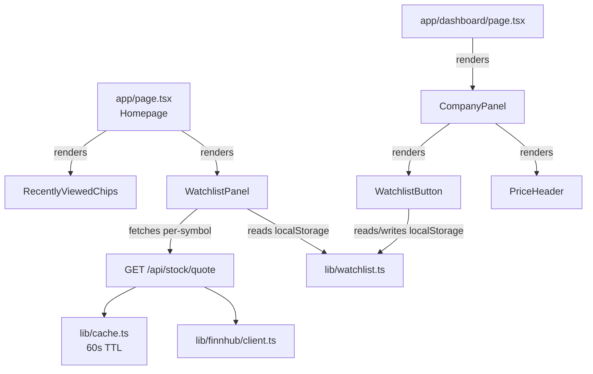

# Watchlist with Persistent Storage — Architecture Plan

> Filename: `docs/watchlist-architecture.md`
> Date: 2026-03-19
> Author: solution-architect

---

## Overview

This document specifies the architecture for Focus 5: Watchlist with Persistent Storage. The feature allows users to explicitly save stocks to a personal watchlist that persists across browser sessions. The watchlist is surfaced on the homepage with live prices, and a save/unsave button appears on the dashboard for each viewed stock.

The goal is to transform the app's relationship with returning users: from a one-off search tool to a monitoring tool that users open specifically to check their saved stocks.

---

## Goals and Success Criteria

- A user can add or remove any stock from the dashboard to/from a persistent watchlist using a star/bookmark button.
- The watchlist survives browser restarts (cross-session persistence via `localStorage`).
- The homepage displays the watchlist as a panel showing each symbol, its current price, and day change — fetched from the existing `/api/stock/quote` endpoint.
- The watchlist is capped at 20 symbols to stay within Finnhub free-tier and server-side rate limit budgets.
- The existing recently viewed chips (`RecentlyViewedChips`) remain visually distinct and are not replaced.
- No new backend routes, no authentication, no database — pure client-side MVP.

---

## Constraints and Assumptions

- **Runtime**: Deno + Next.js 16.x (App Router)
- **TypeScript strict mode** throughout — no `any` types
- **No `tailwind.config.js`** — all utility classes are standard Tailwind v4
- **localStorage only**: the `WatchlistPanel` and `WatchlistButton` are client components; `lib/watchlist.ts` is not a server module and must not import `server-only`
- **SSR safety**: `localStorage` is not available during server-side rendering; all reads/writes must be guarded with `typeof window !== 'undefined'`
- **20-symbol cap**: enforced in `addToWatchlist`; silently no-ops when the cap is reached (does not throw)
- `lucide-react` v0.575.0 is already installed — the `Bookmark` and `BookmarkCheck` icons are available
- The `/api/stock/quote` route is already rate-limited at 30 req/IP/route/60s; 20 parallel quote calls from a single user sits well within this budget
- The server-side cache TTL for quotes is 60 seconds, so 20 homepage loads within 60 seconds cost at most 20 Finnhub calls (first load) and 0 subsequent (cache hits)

---

## Storage Strategy: localStorage for MVP

### Why localStorage

| Option | Verdict |
|--------|---------|
| `localStorage` | Chosen for MVP. Synchronous, universally available, zero backend cost. Already used indirectly — `lib/session.ts` uses `sessionStorage` with the same read/write/guard pattern that `lib/watchlist.ts` will follow. |
| `IndexedDB` | Async, more robust, handles larger datasets. Overkill for a list of at most 20 ticker strings. Adds complexity with no meaningful benefit at this scale. |
| Backend persistence | Enables cross-device sync and analytics. Requires authentication, a database, API routes for CRUD, and session management — a scope increase of at least 3x. Deferred to a future iteration. |

### Data Schema

The watchlist is stored as a JSON-serialised array of uppercase ticker symbol strings:

```
localStorage key: "watchlist"
value: JSON.stringify(string[])  // e.g. '["AAPL","TSLA","MSFT"]'
```

Maximum 20 entries. No metadata (price, name, timestamp) is persisted — all display data is fetched live from `/api/stock/quote` on render. This keeps the schema trivially migratable to any future storage backend.

### Migration Path to Backend Storage

When the team is ready to support cross-device sync, the migration is:

1. Create `POST /api/watchlist/sync` accepting `{ symbols: string[] }` with session/JWT auth.
2. On `WatchlistPanel` mount, call the sync endpoint instead of `localStorage.getItem`.
3. Update `addToWatchlist` / `removeFromWatchlist` to fire an optimistic `localStorage` write immediately (for responsiveness) and then POST the updated list to the backend.
4. Replace the `localStorage` reads in `getWatchlist` and `isInWatchlist` with a React context/SWR fetch that hydrates from the API.
5. The `lib/watchlist.ts` module interface (`getWatchlist`, `addToWatchlist`, `removeFromWatchlist`, `isInWatchlist`) remains unchanged — only the implementation layer changes.

---

## High-Level Architecture



---

## Component Breakdown

### `lib/watchlist.ts`

- **Responsibility**: Pure storage module. Provides the four watchlist operations. Knows nothing about React or the DOM beyond the SSR guard. Mirrors the structure of `lib/session.ts`.
- **Location**: `/lib/watchlist.ts`
- **Technology**: Browser `localStorage`, TypeScript
- **Interface**:
  ```typescript
  export const WATCHLIST_KEY = "watchlist";
  export const MAX_WATCHLIST = 20;

  export type Watchlist = string[];

  export function getWatchlist(): Watchlist
  export function saveWatchlist(symbols: Watchlist): void
  export function addToWatchlist(symbol: string): Watchlist
  export function removeFromWatchlist(symbol: string): Watchlist
  export function isInWatchlist(symbol: string): boolean
  ```
- **SSR safety**: Every function that reads or writes `localStorage` checks `typeof window !== 'undefined'` first and returns a safe default if false.

### `components/dashboard/WatchlistButton.tsx`

- **Responsibility**: Client component. Renders a star/bookmark icon button on the dashboard. Reads and writes watchlist state. Provides visual feedback (green fill when saved, zinc outline when not saved). Allows toggling save/unsave for the current symbol.
- **Location**: `/components/dashboard/WatchlistButton.tsx`
- **Technology**: React, `lucide-react` (`Bookmark`, `BookmarkCheck`), `lib/watchlist.ts`
- **Interface**:
  ```typescript
  interface Props {
    symbol: string;
  }
  export default function WatchlistButton({ symbol }: Props)
  ```
- **Integration point**: Rendered inside `CompanyPanel` in the header row alongside the ticker symbol and `PriceHeader`. Does not modify the `compact` variant of `CompanyPanel` (split/multi views) — the button is only shown in the full default view to avoid cluttering compact layouts.

### `components/dashboard/WatchlistPanel.tsx`

- **Responsibility**: Client component. Reads the watchlist from `localStorage` on mount. Fetches the current quote for each symbol from `/api/stock/quote`. Renders a list of watchlist rows with symbol, formatted current price, and day change (green/red). Includes a remove button per row. Renders null if the watchlist is empty (avoids layout shift, consistent with `RecentlyViewedChips`).
- **Location**: `/components/dashboard/WatchlistPanel.tsx`
- **Technology**: React, `lib/watchlist.ts`, `lib/finnhub/types.ts` (`QuoteResponse`), `lib/utils.ts` (`formatPrice`, `formatChange`, `formatPercent`)
- **Interface**: No props — self-contained panel, reads storage internally.
- **Data fetching**: One `fetch('/api/stock/quote?symbol=X')` call per watchlist symbol, fired in parallel via `Promise.all` inside a `useEffect`. Results stored in a `Map<string, QuoteResponse>` state value.

### `app/page.tsx` (modified)

- **Responsibility**: Homepage Server Component. Renders `WatchlistPanel` below `RecentlyViewedChips`. No props required — `WatchlistPanel` is self-contained.
- The insertion point is below `<RecentlyViewedChips />`, within the existing centered flex column.

---

## Data Flow

### Adding a Stock to the Watchlist (Dashboard)

1. User views `/dashboard?symbol=AAPL`.
2. `CompanyPanel` renders `WatchlistButton` with `symbol="AAPL"`.
3. `WatchlistButton` mounts and calls `isInWatchlist("AAPL")` — reads from `localStorage`. Initial state is `false`.
4. User clicks the button.
5. `WatchlistButton` calls `addToWatchlist("AAPL")`, which reads the current list, prepends `"AAPL"` (deduped), enforces the 20-symbol cap, writes back to `localStorage`, and returns the updated list.
6. React state updates — the button re-renders with the filled `BookmarkCheck` icon in green.

### Removing a Stock from the Watchlist (Dashboard)

1. User views a dashboard where the symbol is already saved (button shows green `BookmarkCheck`).
2. User clicks the button.
3. `WatchlistButton` calls `removeFromWatchlist(symbol)`, which filters the symbol out, writes to `localStorage`, and returns the updated list.
4. Button re-renders with the outline `Bookmark` icon.

### Homepage Watchlist Panel Load

1. User navigates to `/`.
2. `app/page.tsx` (Server Component) renders `WatchlistPanel` as a client component.
3. `WatchlistPanel` mounts on the client. `useEffect` fires.
4. `getWatchlist()` reads from `localStorage`. If empty, component returns null.
5. If non-empty, `Promise.all` fires one `fetch('/api/stock/quote?symbol=X')` per saved symbol.
6. Server-side cache (60s TTL) absorbs repeated calls. Finnhub is called at most once per symbol per 60 seconds regardless of how many users load the homepage.
7. Quote responses are stored in a `Map<string, QuoteResponse>` React state. Component re-renders to show prices.
8. Each row shows: symbol | current price | day change (green/red) | remove button.
9. Clicking remove calls `removeFromWatchlist(symbol)` and updates the local state to drop that row — no page reload required.

---

## Implementation Plan

### Step 1 — `lib/watchlist.ts` (Low complexity)

Implement the storage module. No dependencies on other new components. Mirrors `lib/session.ts` structure.

Produces: `getWatchlist`, `saveWatchlist`, `addToWatchlist`, `removeFromWatchlist`, `isInWatchlist`.

### Step 2 — `components/dashboard/WatchlistButton.tsx` (Low complexity)

Depends on Step 1. Client component. Uses `useState` for the saved state, `useEffect` to read from `localStorage` on mount (hydration-safe). Uses `Bookmark` / `BookmarkCheck` from `lucide-react`.

### Step 3 — Integrate `WatchlistButton` into `CompanyPanel` (Low complexity)

Depends on Step 2. Add `WatchlistButton` to the header row in `CompanyPanel.tsx`. Only render in the non-compact variant (`!compact`) so it does not appear in split or multi views.

### Step 4 — `components/dashboard/WatchlistPanel.tsx` (Medium complexity)

Depends on Step 1. Parallel quote fetching, loading skeleton, error handling per symbol, remove-in-place UX. Re-uses `formatPrice`, `formatChange`, `formatPercent` from `lib/utils.ts`.

### Step 5 — Integrate `WatchlistPanel` into `app/page.tsx` (Low complexity)

Depends on Step 4. One-line insertion below `<RecentlyViewedChips />`.

### Step 6 — Unit tests for `lib/watchlist.ts` (Low complexity)

Depends on Step 1. Pure function tests using `Deno.test`. Mock `localStorage` via `globalThis` override — no browser required.

---

## Rate Limit Budget

The server-side rate limiter allows 30 requests per IP per route per 60 seconds.

| Scenario | Quote calls | Within limit? |
|----------|------------|---------------|
| Homepage load, 20-symbol watchlist, cold cache | 20 | Yes (20/30) |
| Homepage load, 20-symbol watchlist, warm cache (60s) | 0 (all cached) | Yes |
| Dashboard in default view + homepage open simultaneously | 1 + up to 20 | Yes (21/30) |
| Multi-view (3 panels) + homepage watchlist | 3 + up to 20 | Yes (23/30) |

The 60-second server cache TTL ensures that the worst case (first visitor per minute, full cold cache) is 20 Finnhub calls — well within the 30 req/minute Finnhub free-tier limit for a single user.

---

## Testing Strategy

### Unit tests — `tests/unit/watchlist.test.ts`

All tests use `Deno.test`. `localStorage` must be stubbed via a `globalThis.localStorage` replacement (a simple object implementing `getItem`/`setItem`/`removeItem`) because Deno's test environment does not include browser APIs.

| Test case | Function |
|-----------|----------|
| Returns empty array when `localStorage` is empty | `getWatchlist` |
| Returns empty array when `localStorage` contains invalid JSON | `getWatchlist` |
| Returns stored symbols after `saveWatchlist` | `getWatchlist` |
| Adds a symbol to an empty list | `addToWatchlist` |
| Deduplicates an already-present symbol | `addToWatchlist` |
| Enforces 20-symbol cap (21st call is a no-op) | `addToWatchlist` |
| Removes an existing symbol | `removeFromWatchlist` |
| No-ops gracefully when removing a symbol not in the list | `removeFromWatchlist` |
| Returns true for a saved symbol | `isInWatchlist` |
| Returns false for an unsaved symbol | `isInWatchlist` |
| Returns false when `window` is undefined (SSR guard) | All functions |

### E2E tests (Playwright) — deferred to `qa-strategist`

- Add a symbol to the watchlist from the dashboard; navigate to homepage; assert panel shows the symbol.
- Remove a symbol from the watchlist panel; assert the row disappears without page reload.
- Add 20 symbols; assert the 21st add button becomes a no-op (does not change count to 21).
- Reload the browser; assert the watchlist persists.

---

## Security and Performance Considerations

### Security

- **No sensitive data in `localStorage`**: Only ticker symbol strings (e.g., `"AAPL"`) are stored. No prices, no user identifiers.
- **Input validation**: `addToWatchlist` validates the symbol against the same `^[A-Z]{1,10}$` pattern used by the quote route handler. Silently rejects invalid symbols before writing to `localStorage`.
- **JSON parse safety**: All `localStorage.getItem` calls are wrapped in `try/catch`. Corrupted storage returns `[]` without throwing.
- **XSS**: Symbols are rendered as text content only, never as HTML. No `dangerouslySetInnerHTML`.

### Performance

- **Parallel quote fetching**: `Promise.all` fires all watchlist quote calls simultaneously. With 20 symbols and a 60s cache, the effective latency is one network round-trip — not 20 sequential calls.
- **No layout shift**: `WatchlistPanel` renders `null` until the `useEffect` has read from `localStorage`. This matches the `RecentlyViewedChips` pattern and avoids CLS.
- **No hydration mismatch**: Server renders nothing (Server Component passes no watchlist data), client reads `localStorage` after mount. This is the correct pattern for client-only persistence.
- **Loading skeleton**: While quote fetches are in-flight, each row renders a pulse skeleton matching the expected layout height — prevents layout jumps when prices arrive.

---

## Open Questions

None blocking implementation. The following are noted for future consideration:

1. **Should `WatchlistButton` appear in compact (split/multi) view?** Current recommendation: no — compact panels are already information-dense. Revisit if user testing shows demand.
2. **Should the watchlist panel appear above or below recently viewed chips?** Current recommendation: below, since recently viewed chips are a lighter-weight navigation aid that benefits from proximity to the search bar. The watchlist is a deliberate, persistent list that anchors a different part of the page.
3. **Cap at 20 — is this the right number?** 20 is the maximum safe value given the 30 req/IP/route/minute rate limit with headroom for dashboard polling. If the rate limit is increased, the cap can be raised without any structural changes.

---

## References

- `lib/session.ts` — pattern for `sessionStorage` read/write/guard; `lib/watchlist.ts` follows the same structure with `localStorage`
- `components/search/RecentlyViewedChips.tsx` — pattern for SSR-safe client component that reads storage on mount and renders null when empty
- `components/dashboard/PriceHeader.tsx` — pattern for client-side quote fetching with loading skeleton and error handling
- `app/api/stock/quote/route.ts` — quote endpoint shape (`QuoteResponse`) and 60s cache TTL
- `lib/ratelimit.ts` — rate limit budget (30 req/IP/route/60s) used for the rate limit budget table above
- `docs/next-five-product-focuses.md` — product context and scope definition for Focus 5
