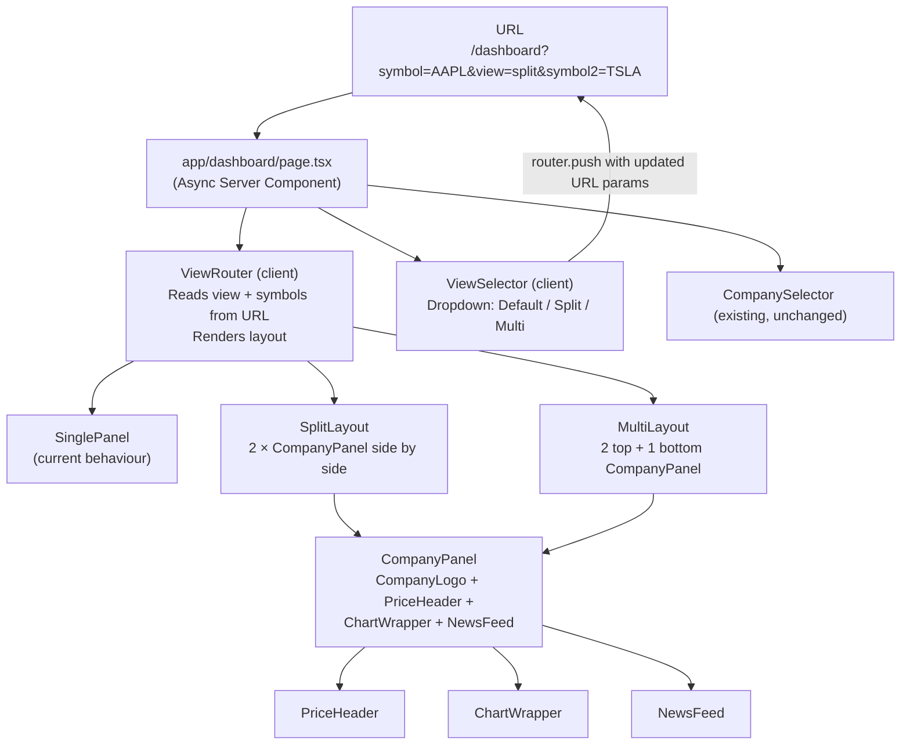

# Multi-Company View Modes — Architecture Report

## Executive Summary

This feature introduces two new view modes to the dashboard, allowing users to compare multiple companies simultaneously without leaving the dashboard page.

**Split View** renders two company panels side by side. **Multi View** renders three company panels in a bento-box layout: two panels on the top row and one spanning the full width on the bottom. Both modes are activated via a new view selector control placed adjacent to the existing `CompanySelector` dropdown. Returning to the **Default View** (single panel) is always one click away from the same control.

The primary design challenge is that the existing dashboard is built as a single-symbol page: `app/dashboard/page.tsx` reads one `?symbol=` search param and passes it to three independent client components (`PriceHeader`, `ChartWrapper`, `NewsFeed`). This architecture must be extended — not replaced — to support rendering those same three components once per visible company panel, with view state and symbol assignments encoded cleanly in the URL so that any multi-company view is bookmarkable and shareable.

---

## Pre-Implementation Requirements

The following items were identified during frontend review and **must be resolved before implementation begins**. They are listed in impact order.

| # | Requirement | Impact | Resolution |
|---|---|---|---|
| 1 | Extract `loadRecent` / `saveRecent` / `mergeSymbol` / `STORAGE_KEY` / `MAX_RECENT` from `CompanySelector.tsx` to `lib/session.ts` | **Blocking** — `ViewSelector` cannot import module-private functions | Added as Task 0 in the checklist |
| 2 | Suppress news feed in compact panels (`showNews={false}` default) | **Blocking UX** — each panel's news feed is ~960 px; multi-view becomes unscrollable | Elevated from Open Question 3 to a firm requirement; `CompanyPanel` interface updated |
| 3 | Thread `compact` into `ChartWrapper` loading skeleton height | High — causes visible layout shift (CLS) when chart loads at `h-52` after skeleton at `h-72` | Updated Task 4 and `ChartWrapper` component description |
| 4 | Active view must have an ARIA indicator in `ViewSelector` | High (a11y) — screen reader users cannot tell which mode is active | `DropdownMenuCheckboxItem` with `checked` prop specified in `ViewSelector` description |
| 5 | `CompanyPanel` must wrap content in `<section aria-label={symbol}>` | Medium (a11y) — duplicate `<h2>` headings across panels confuse screen reader document outline | Added to `CompanyPanel` accessibility note |
| 6 | E2E tests for User Stories 1 & 2 must call `mockDashboardMulti` before `page.goto` | Medium — original order allows real network requests to fire on initial page load | Fixed in both test code samples |
| 7 | `parseDashboardParams` must apply `[A-Z]{1,10}` regex, not just `.toUpperCase()` | Low (security) — raw symbols with non-alpha characters were passed through to the DOM | `SYMBOL_RE` and `sanitizeSymbol` added to `lib/view.ts` code sample |

---

## Goals and Success Criteria

- A user can activate split view and immediately see data for their current company alongside the top-ranked recently viewed company, without any manual extra selection step.
- A user can activate multi view and immediately see data for their current company plus the top two other recently viewed companies.
- Switching from split or multi view back to default view restores a single-company dashboard without a full page reload.
- All view state and active symbols are encoded in the URL so the browser Back button works correctly and any view can be shared via a URL.
- Existing single-company behaviour is completely unchanged. The default route `/dashboard?symbol=AAPL` continues to behave exactly as it does today.
- No existing API routes are modified. The existing per-component `useEffect` fetch pattern is reused verbatim within each panel.
- All four new user stories have corresponding Playwright E2E test coverage.

---

## Constraints and Assumptions

- **Desktop only.** No responsive behaviour below 1024 px is required. Multi-column grid layouts can use fixed Tailwind column classes without responsive variants.
- **Three existing dashboard client components** (`PriceHeader`, `ChartWrapper`, `NewsFeed`) accept a single `symbol: string` prop and self-fetch. They can be rendered multiple times on the same page with different symbol props without any internal changes.
- **`CompanySelector` sessionStorage list** is the source of truth for which "other" symbols to auto-populate into split and multi view slots on activation. The first item is always `currentSymbol`; the second item becomes the split-view companion; the third item (if present) fills the third multi-view slot.
- **Minimum symbol count for view modes.** Split view requires at least two symbols in the recent list; multi view requires at least three. If the list is too short, the missing slots render a placeholder panel prompting the user to visit additional companies first.
- **URL is the single source of truth.** View mode and the active symbols for all panels are read from `searchParams` in the Server Component. Client components read the URL via `useSearchParams` when they need to navigate.
- **No new API routes are needed.** All data is fetched by the existing `/api/stock/*` routes. The browser will make parallel requests for each panel's symbol concurrently; the server-side cache in `lib/cache.ts` ensures repeated symbols across panels do not cause duplicate upstream Finnhub calls.
- **`CompanySelector` behaviour in multi-panel views.** In split and multi view, the `CompanySelector` changes only the primary (`symbol`) company. The secondary symbols (`symbol2`, `symbol3`) are populated automatically on view activation and can only be changed by switching back to default view and revisiting a company, which adds it to the recent list.

---

## High-Level Architecture



**Key principle.** The Server Component reads all URL params (including `view`, `symbol2`, `symbol3`) and passes typed props to client components. The client never needs to parse the URL itself except when constructing navigation URLs for the `ViewSelector`.

---

## View Mode Design

### Default View (existing)

The current single-panel layout is preserved exactly. A full-width column containing `CompanyLogo` + `PriceHeader`, then `ChartWrapper`, then `NewsFeed`.

```
┌─────────────────────────────────────────────┐
│  Logo  AAPL  $261.74  +1.34%                │
├─────────────────────────────────────────────┤
│  Price History chart (full width)           │
├─────────────────────────────────────────────┤
│  Latest News feed (full width)              │
└─────────────────────────────────────────────┘
```

### Split View

Two `CompanyPanel` columns, equal width, separated by a `border-r border-zinc-800` divider.

```
┌───────────────────────┬───────────────────────┐
│  Logo  AAPL  $261.74  │  Logo  TSLA  $420.00  │
├───────────────────────┼───────────────────────┤
│  Chart (half width)   │  Chart (half width)   │
├───────────────────────┼───────────────────────┤
│  News (half width)    │  News (half width)    │
└───────────────────────┴───────────────────────┘
```

Tailwind layout: `grid grid-cols-2 gap-0 divide-x divide-zinc-800` on the content wrapper. Each column is `min-w-0` to allow correct chart canvas sizing.

### Multi View

Three `CompanyPanel` instances. The top row holds two equal-width panels. The bottom row holds one full-width panel.

```
┌───────────────────────┬───────────────────────┐
│  Logo  AAPL  $261.74  │  Logo  TSLA  $420.00  │
├───────────────────────┼───────────────────────┤
│  Chart (half width)   │  Chart (half width)   │
├───────────────────────┼───────────────────────┤
│  News (half width)    │  News (half width)    │
├───────────────────────┴───────────────────────┤
│  Logo  MSFT  $415.00                          │
├────────────────────────────────────────────────┤
│  Chart (full width)                           │
├────────────────────────────────────────────────┤
│  News (full width)                            │
└────────────────────────────────────────────────┘
```

Tailwind layout: top row uses `grid grid-cols-2 divide-x divide-zinc-800`; a `border-t border-zinc-800` separates it from the bottom panel which is `w-full`.

### Chart Sizing Note

`StockChart` uses `maintainAspectRatio: false` and renders inside a `relative h-72 w-full` container. In split and multi views, `h-72` should be reduced to `h-52` to keep each panel compact and avoid excessive vertical scrolling. This is achieved by passing an optional `compact?: boolean` prop to `CompanyPanel`, which passes it through to `ChartWrapper` and then to `StockChart`. The `compact` prop must also control the `ChartWrapper` loading skeleton height to prevent layout shift.

All `animate-pulse` loading skeleton divs throughout the project (`ChartWrapper.tsx`, `PriceHeader.tsx`, `NewsFeed.tsx`, `StockChart.tsx`) should include `motion-reduce:animate-none` to respect the user's reduced-motion preference. In multi-panel view, up to six elements pulse simultaneously, which is the point at which this omission becomes most noticeable. This should be addressed during this feature's implementation.

### Placeholder Panel

When a view mode is activated but there are insufficient recent symbols:

```
┌─────────────────────────────────────────┐
│  No company selected                    │
│  Visit additional companies to populate │
│  this panel.                            │
└─────────────────────────────────────────┘
```

Rendered as a bordered `div` with muted zinc text, matching the existing error-state aesthetic.

---

## State Management

### Source of Truth: URL Search Parameters

All persistent state — view mode and active symbols — lives in the URL. This means:

- Views are bookmarkable and shareable.
- The browser Back/Forward buttons work correctly.
- The Next.js Server Component can read everything it needs from `searchParams` with no hydration step.

#### URL Schema

| View | Example URL |
|---|---|
| Default | `/dashboard?symbol=AAPL` |
| Split | `/dashboard?symbol=AAPL&view=split&symbol2=TSLA` |
| Multi | `/dashboard?symbol=AAPL&view=multi&symbol2=TSLA&symbol3=MSFT` |

`view` defaults to `"default"` when absent. `symbol2` and `symbol3` are ignored when `view` is absent or `"default"`.

#### Search Param Types

Defined in a new shared type file `lib/view.ts`:

```typescript
export type ViewMode = "default" | "split" | "multi";

export interface DashboardParams {
  symbol: string;
  view: ViewMode;
  symbol2: string | null;
  symbol3: string | null;
}

const SYMBOL_RE = /^[A-Z]{1,10}$/;

function sanitizeSymbol(raw: string | string[] | undefined): string | null {
  if (typeof raw !== "string") return null;
  const stripped = raw.toUpperCase().replace(/[^A-Z]/g, "").slice(0, 10);
  return SYMBOL_RE.test(stripped) ? stripped : null;
}

export function parseDashboardParams(
  raw: Record<string, string | string[] | undefined>
): DashboardParams {
  const symbol = typeof raw.symbol === "string"
    ? raw.symbol.toUpperCase().replace(/[^A-Z]/g, "").slice(0, 10)
    : "";
  const view = (raw.view === "split" || raw.view === "multi")
    ? raw.view
    : "default";
  const symbol2 = sanitizeSymbol(raw.symbol2);
  const symbol3 = sanitizeSymbol(raw.symbol3);
  return { symbol, view, symbol2, symbol3 };
}
```

This parser lives server-side and is called in `app/dashboard/page.tsx`.

### Client-Side Navigation (ViewSelector)

The `ViewSelector` component reads the current URL via `useSearchParams` (a Next.js App Router hook) to know the active mode. On selection, it calls `router.push` with a new URL constructed using `URLSearchParams`, preserving the current `symbol` while setting or removing `view`, `symbol2`, and `symbol3`.

When activating split or multi view, `ViewSelector` reads `sessionStorage` (via the same `loadRecent()` helper from `CompanySelector`) to determine which symbols to auto-fill into `symbol2` and `symbol3`.

No React Context or global state store is needed.

---

## Component Architecture

### New Components

#### `components/dashboard/ViewSelector.tsx`

- **Responsibility.** Renders a Shadcn `DropdownMenu` button adjacent to `CompanySelector` in the header. The dropdown contains three items: Default View, Split View, Multi View. Selecting an item constructs and pushes a new URL. The active view is indicated both visually and programmatically.
- **Location.** `/components/dashboard/ViewSelector.tsx`
- **Technology.** Client Component. Shadcn `DropdownMenu` (already available via Shadcn install). `useRouter`, `usePathname`, `useSearchParams` from `next/navigation`.
- **Interface.**

```typescript
interface Props {
  currentSymbol: string;
}
```

The component derives everything else (current view, symbol2, symbol3) from `useSearchParams`.

- **Why `DropdownMenu` not `Select`.** The view selector is an action menu, not a form field. `DropdownMenu` from Shadcn is semantically appropriate for a list of navigation actions, has better keyboard accessibility for this pattern, and visually matches the button-style trigger better than `Select`'s form-input trigger. The Shadcn `DropdownMenu` component must be added to the project via `npx shadcn@latest add dropdown-menu`.
- **Active state (accessibility requirement).** Use `DropdownMenuCheckboxItem` instead of `DropdownMenuItem` for each option and set `checked={currentView === mode}`. This renders `aria-checked="true"` on the active item, ensuring screen reader users know which view is currently active without having to inspect the page layout. Visually this adds a checkmark icon to the active item.
- **Trigger label (accessibility requirement).** The trigger `Button` must carry `aria-label="Select dashboard view mode"` (or equivalent descriptive text) to distinguish it from the adjacent `CompanySelector` for keyboard and screen reader users.
- **Focus management on view switch.** After `router.push` fires, add a visually-hidden `<div role="status" aria-live="polite" className="sr-only">` that announces the new view name (e.g. "Switched to split view"). This ensures screen reader users receive feedback when the layout changes.
- **Visual consistency.** The trigger `Button` must match the existing `CompanySelector` zinc colour palette (`border-zinc-700 bg-zinc-900 text-zinc-100`) to maintain visual weight parity between the two adjacent controls.

#### `components/dashboard/CompanyPanel.tsx`

- **Responsibility.** A self-contained wrapper that renders the full data display for a single company: logo + price header, chart, and news feed. This extracts the inner content that currently lives directly in `app/dashboard/page.tsx` into a reusable unit that can be stamped out once (default), twice (split), or three times (multi).
- **Location.** `/components/dashboard/CompanyPanel.tsx`
- **Technology.** Client Component (because its children are client components). Accepts `symbol`, `compact`, and `showNews` props.
- **Interface.**

```typescript
interface Props {
  symbol: string;
  compact?: boolean;
  showNews?: boolean;
}
```

- **Content.** Renders the same structure currently in `dashboard/page.tsx`'s `<main>` block: the header row with `CompanyLogo` + `PriceHeader`, `ChartWrapper`, and `NewsFeed`. When `compact` is `true`, it passes a reduced chart height class (`h-52` instead of `h-72`) to `ChartWrapper`. When `showNews` is `false` (the default in split and multi view), `NewsFeed` is not rendered — this is a firm requirement to prevent each panel's news feed (~960 px of article cards) from making multi-panel views unscrollably long.
- **Accessibility.** The outermost element must be a `<section aria-label={symbol}>` rather than a plain `<div>`. This creates a named landmark region per panel, preventing duplicate `<h2>` headings ("Price History", "Latest News") from creating a confusing document outline for screen reader users navigating by heading.

#### `components/dashboard/PlaceholderPanel.tsx`

- **Responsibility.** Renders a muted placeholder panel for a multi-panel slot that has no assigned symbol. Used when the recent-symbols list has fewer entries than the active view mode requires.
- **Location.** `/components/dashboard/PlaceholderPanel.tsx`
- **Technology.** Pure presentational component, no state.
- **Interface.** No props.

### Existing Components to Modify

#### `app/dashboard/page.tsx`

- **Change.** Read the additional `view`, `symbol2`, `symbol3` params from `searchParams` using `parseDashboardParams`. Pass them to the updated header section and the new `ViewRouter` rendering logic. The page now conditionally renders `CompanyPanel` once, twice, or three times depending on view mode.
- **Surgical edit only.** The page shell (header, nav, footer) is unchanged. The `<main>` block is replaced with a conditional that delegates to the appropriate layout.

```typescript
// Before (simplified):
<main>
  <CompanyLogo symbol={ticker} />
  <PriceHeader symbol={ticker} />
  <ChartWrapper symbol={ticker} />
  <NewsFeed symbol={ticker} />
</main>

// After (simplified):
<main>
  {view === "default" && <CompanyPanel symbol={ticker} />}
  {view === "split" && (
    <div className="grid grid-cols-2 divide-x divide-zinc-800">
      <CompanyPanel symbol={ticker} compact showNews={false} />
      {symbol2
        ? <CompanyPanel symbol={symbol2} compact showNews={false} />
        : <PlaceholderPanel />}
    </div>
  )}
  {view === "multi" && (
    <>
      <div className="grid grid-cols-2 divide-x divide-zinc-800 border-b border-zinc-800">
        <CompanyPanel symbol={ticker} compact showNews={false} />
        {symbol2
          ? <CompanyPanel symbol={symbol2} compact showNews={false} />
          : <PlaceholderPanel />}
      </div>
      <div>
        {symbol3
          ? <CompanyPanel symbol={symbol3} />
          : <PlaceholderPanel />}
      </div>
    </>
  )}
</main>
```

The full `searchParams` type annotation is updated to include the new params:

```typescript
interface Props {
  searchParams: Promise<{
    symbol?: string;
    view?: string;
    symbol2?: string;
    symbol3?: string;
  }>;
}
```

#### `app/dashboard/page.tsx` — Header Row

- **Change.** Add `<ViewSelector currentSymbol={ticker} />` next to `<CompanySelector currentSymbol={ticker} />` in the header. The two controls sit in a flex row: `<div className="flex items-center gap-2">`.

#### `components/dashboard/ChartWrapper.tsx`

- **Change.** Accept an optional `compact?: boolean` prop and pass it through to `StockChart`. The `compact` prop must also be applied to the loading skeleton `<div>` height (`h-52` when `compact`, `h-72` otherwise). Failing to do so causes a measurable layout shift (CLS) when the chart mounts and the container snaps from 288 px to 208 px. The skeleton height must match the loaded chart height exactly.

#### `components/dashboard/StockChart.tsx`

- **Change.** Accept an optional `compact?: boolean` prop. When `true`, use `h-52` for the chart container height instead of `h-72`. This is a single conditional class change on the `<div className="relative h-72 w-full">` line.

### Components That Require No Changes

| Component | Reason |
|---|---|
| `CompanySelector` | Continues to control only `symbol`. Its sessionStorage list is read by `ViewSelector` — no code change needed in `CompanySelector` itself. |
| `PriceHeader` | Already accepts `{ symbol: string }`. Works correctly in any layout context. |
| `NewsFeed` | Already accepts `{ symbol: string }`. No changes needed. |
| `CompanyLogo` | Already accepts `{ symbol: string }`. No changes needed. |
| All API route handlers | No changes. Multiple concurrent client-side fetches to the same route with different symbols are already handled. The server-side cache ensures no duplicate upstream calls for repeated symbols. |

---

## Data Fetching Strategy

The existing data fetching pattern — each client component independently calls its own `/api/stock/*` route in a `useEffect` — scales to multi-panel rendering without any structural changes.

When two or three `CompanyPanel` instances mount simultaneously:

1. `PriceHeader` in each panel fires `GET /api/stock/quote?symbol=X` concurrently.
2. `ChartWrapper` in each panel fires `GET /api/stock/candles?symbol=X&range=3M` concurrently.
3. `NewsFeed` in each panel fires `GET /api/stock/news?symbol=X` concurrently.

The browser issues all of these in parallel. On the server, each Route Handler checks `lib/cache.ts` before calling Finnhub. If two panels share the same symbol (which should not happen by design, but is harmless), the second request is served from the cache.

**Finnhub rate limit.** The free tier allows 60 requests per minute. A full multi-view page load for three unique companies makes 9 concurrent upstream calls (3 data types × 3 companies). This is well within the limit. The cache ensures subsequent navigations (Back/Forward, same symbol revisited) make zero upstream calls within the TTL window.

**No refactoring required.** The decision to keep per-component fetching rather than lifting data to the page level is deliberate. It preserves independent error isolation (a news failure in panel 2 does not affect panel 1's chart) and keeps existing component tests valid.

---

## URL and Routing Design

### Parameter Specification

| Parameter | Type | Values | Default | Description |
|---|---|---|---|---|
| `symbol` | `string` | Uppercase ticker, e.g. `AAPL` | Required | Primary company (panel 1). Existing behaviour. |
| `view` | `string` | `default`, `split`, `multi` | `default` | Active view mode. |
| `symbol2` | `string` | Uppercase ticker | `null` | Company for panel 2 (split + multi views). |
| `symbol3` | `string` | Uppercase ticker | `null` | Company for panel 3 (multi view only). |

### URL Construction in ViewSelector

`ViewSelector` uses `useSearchParams` to read the current params and `useRouter` to navigate. The utility below (placed at the top of `ViewSelector.tsx`) constructs clean URLs:

```typescript
function buildViewUrl(
  pathname: string,
  current: URLSearchParams,
  mode: ViewMode,
  recentSymbols: string[]
): string {
  const params = new URLSearchParams();
  params.set("symbol", current.get("symbol") ?? "");

  if (mode === "split") {
    params.set("view", "split");
    if (recentSymbols[1]) params.set("symbol2", recentSymbols[1]);
  } else if (mode === "multi") {
    params.set("view", "multi");
    if (recentSymbols[1]) params.set("symbol2", recentSymbols[1]);
    if (recentSymbols[2]) params.set("symbol3", recentSymbols[2]);
  }
  // "default" mode: only symbol param, no view/symbol2/symbol3

  return `${pathname}?${params.toString()}`;
}
```

Omitting `view` entirely (rather than setting `view=default`) keeps default-view URLs clean and backward-compatible with existing bookmarks.

### Bookmarkability

A URL like `/dashboard?symbol=AAPL&view=split&symbol2=TSLA` renders the split view deterministically on any load. The `ViewSelector` reads these params from `useSearchParams` on mount to reflect the correct active state in the dropdown.

### Server Component Rendering

Because `searchParams` is read in the Server Component, the page re-renders on navigation. This is the standard Next.js App Router behaviour for dynamic pages that read `searchParams`. No `Suspense` boundary is needed specifically for `searchParams` reading in the Server Component; `Suspense` boundaries are already in place via the `dynamic()` import for `StockChart`.

---

## Branching Strategy

A single feature branch is appropriate. The feature is cohesive and the changes are focused.

```
feature/multi-company-view
```

Branch from: `main`
Merge target: `main` via pull request

### Rationale for a Single Branch

All parts of this feature are interdependent. The `ViewSelector` UI, the `CompanyPanel` extraction, the URL schema, and the tests are all part of one coherent user-facing feature. Splitting into sub-branches would require cross-branch coordination and offers no meaningful isolation benefit given the scope.

If parallel development across agents is required, the branch can be subdivided:

```
feature/multi-company-view/url-schema         # lib/view.ts + page.tsx param reading
feature/multi-company-view/company-panel      # CompanyPanel + PlaceholderPanel components
feature/multi-company-view/view-selector      # ViewSelector component
feature/multi-company-view/layout-wiring      # page.tsx layout switch + ChartWrapper compact prop
feature/multi-company-view/tests              # E2E + unit tests
```

Each sub-branch merges into `feature/multi-company-view`, not directly into `main`.

---

## Testing Plan

### E2E Tests (Playwright)

All four new user stories map directly to E2E test cases in a new spec file: `tests/e2e/view-modes.spec.ts`.

The existing `mockDashboard` helper from `dashboard.spec.ts` is reused but extended to handle multiple symbols. A new `mockDashboardMulti` helper mocks all `**/api/stock/quote*`, `**/api/stock/candles*`, and `**/api/stock/news*` requests, returning symbol-appropriate fixture data based on which `?symbol=` value is present in the request URL.

#### User Story 1 — Split View Activation

> Given I am on the dashboard page
> When I select the views menu and choose the split view option
> Then I will see my current company, and the company at the top of the dropdown list.

```typescript
test("split view shows current company and top recent company", async ({ page }) => {
  // Mock must be registered before page.goto to intercept the initial page load
  mockDashboardMulti(page);

  await page.goto("/dashboard?symbol=AAPL");

  // Seed sessionStorage after the page has loaded (requires a DOM context)
  await page.evaluate(() => {
    sessionStorage.setItem("recentSymbols", JSON.stringify(["AAPL", "TSLA"]));
  });

  // Activate split view
  await page.getByRole("button", { name: "View" }).click();
  await page.getByRole("menuitem", { name: "Split View" }).click();

  // URL should reflect split view
  await expect(page).toHaveURL(/view=split/);
  await expect(page).toHaveURL(/symbol2=TSLA/);

  // Both panels must be visible
  await expect(page.getByTestId("company-panel-AAPL")).toBeVisible();
  await expect(page.getByTestId("company-panel-TSLA")).toBeVisible();
});
```

#### User Story 2 — Multi View Activation

> Given I am on the dashboard page
> When I select the views menu and choose the multi view option
> Then I will see my current company, the company at the top of the dropdown list and the next company in the dropdown list.

```typescript
test("multi view shows three companies", async ({ page }) => {
  // Mock must be registered before page.goto to intercept the initial page load
  mockDashboardMulti(page);

  await page.goto("/dashboard?symbol=AAPL");

  // Seed sessionStorage after the page has loaded (requires a DOM context)
  await page.evaluate(() => {
    sessionStorage.setItem(
      "recentSymbols",
      JSON.stringify(["AAPL", "TSLA", "MSFT"])
    );
  });

  await page.getByRole("button", { name: "View" }).click();
  await page.getByRole("menuitem", { name: "Multi View" }).click();

  await expect(page).toHaveURL(/view=multi/);
  await expect(page).toHaveURL(/symbol2=TSLA/);
  await expect(page).toHaveURL(/symbol3=MSFT/);

  await expect(page.getByTestId("company-panel-AAPL")).toBeVisible();
  await expect(page.getByTestId("company-panel-TSLA")).toBeVisible();
  await expect(page.getByTestId("company-panel-MSFT")).toBeVisible();
});
```

#### User Story 3 — Return to Default from Split View

> Given I am on the dashboard page and have split view selected
> When I select the default view
> Then I will see my current company only.

```typescript
test("selecting default view from split view shows one panel", async ({ page }) => {
  mockDashboardMulti(page);
  await page.goto("/dashboard?symbol=AAPL&view=split&symbol2=TSLA");

  // Confirm split view is active
  await expect(page.getByTestId("company-panel-AAPL")).toBeVisible();
  await expect(page.getByTestId("company-panel-TSLA")).toBeVisible();

  // Switch back to default
  await page.getByRole("button", { name: "View" }).click();
  await page.getByRole("menuitem", { name: "Default View" }).click();

  await expect(page).toHaveURL(/symbol=AAPL/);
  await expect(page).not.toHaveURL(/view=split/);

  // Only one panel should exist
  await expect(page.getByTestId("company-panel-AAPL")).toBeVisible();
  await expect(page.getByTestId("company-panel-TSLA")).not.toBeVisible();
});
```

#### User Story 4 — Return to Default from Multi View

> Given I am on the dashboard page and have multi view selected
> When I select the default view
> Then I will see my current company only.

```typescript
test("selecting default view from multi view shows one panel", async ({ page }) => {
  mockDashboardMulti(page);
  await page.goto("/dashboard?symbol=AAPL&view=multi&symbol2=TSLA&symbol3=MSFT");

  await expect(page.getByTestId("company-panel-AAPL")).toBeVisible();
  await expect(page.getByTestId("company-panel-TSLA")).toBeVisible();
  await expect(page.getByTestId("company-panel-MSFT")).toBeVisible();

  await page.getByRole("button", { name: "View" }).click();
  await page.getByRole("menuitem", { name: "Default View" }).click();

  await expect(page).toHaveURL(/symbol=AAPL/);
  await expect(page).not.toHaveURL(/view=multi/);

  await expect(page.getByTestId("company-panel-AAPL")).toBeVisible();
  await expect(page.getByTestId("company-panel-TSLA")).not.toBeVisible();
  await expect(page.getByTestId("company-panel-MSFT")).not.toBeVisible();
});
```

#### Additional E2E Tests (Robustness)

These cover edge cases raised by the constraints:

```typescript
test("split view with only one recent symbol shows placeholder for second panel", async ({
  page,
}) => {
  await page.goto("/dashboard?symbol=AAPL");
  await page.evaluate(() => {
    sessionStorage.setItem("recentSymbols", JSON.stringify(["AAPL"]));
  });
  mockDashboardMulti(page);

  await page.getByRole("button", { name: "View" }).click();
  await page.getByRole("menuitem", { name: "Split View" }).click();

  await expect(page.getByTestId("company-panel-AAPL")).toBeVisible();
  await expect(page.getByTestId("placeholder-panel")).toBeVisible();
});

test("split view URL is bookmarkable and loads correctly on direct navigation", async ({
  page,
}) => {
  mockDashboardMulti(page);
  await page.goto("/dashboard?symbol=AAPL&view=split&symbol2=TSLA");

  await expect(page.getByTestId("company-panel-AAPL")).toBeVisible();
  await expect(page.getByTestId("company-panel-TSLA")).toBeVisible();
});
```

### Unit Tests (Deno)

New unit tests live in `tests/unit/view.test.ts`. They cover the `parseDashboardParams` utility from `lib/view.ts`.

```typescript
import { assertEquals } from "jsr:@std/assert";
import { parseDashboardParams } from "../../lib/view.ts";

Deno.test("parseDashboardParams: default view when view param absent", () => {
  const result = parseDashboardParams({ symbol: "AAPL" });
  assertEquals(result.view, "default");
  assertEquals(result.symbol2, null);
  assertEquals(result.symbol3, null);
});

Deno.test("parseDashboardParams: split view with symbol2", () => {
  const result = parseDashboardParams({ symbol: "AAPL", view: "split", symbol2: "tsla" });
  assertEquals(result.view, "split");
  assertEquals(result.symbol2, "TSLA"); // uppercased
});

Deno.test("parseDashboardParams: multi view with symbol2 and symbol3", () => {
  const result = parseDashboardParams({
    symbol: "AAPL",
    view: "multi",
    symbol2: "TSLA",
    symbol3: "msft",
  });
  assertEquals(result.view, "multi");
  assertEquals(result.symbol2, "TSLA");
  assertEquals(result.symbol3, "MSFT"); // uppercased
});

Deno.test("parseDashboardParams: unknown view value falls back to default", () => {
  const result = parseDashboardParams({ symbol: "AAPL", view: "quad" });
  assertEquals(result.view, "default");
});

Deno.test("parseDashboardParams: ignores symbol2 when view is default", () => {
  // Even if symbol2 is present in the URL, the parser still returns it —
  // the page simply does not use it when view === "default"
  const result = parseDashboardParams({ symbol: "AAPL", symbol2: "TSLA" });
  assertEquals(result.view, "default");
  assertEquals(result.symbol2, "TSLA"); // parsed but not rendered
});
```

### Test Data Requirements

The `mockDashboardMulti` helper in `view-modes.spec.ts` must differentiate responses by the `symbol` query parameter so price figures shown in each panel are distinct (confirming the correct company is displayed in each slot):

```typescript
function mockDashboardMulti(
  page: Parameters<Parameters<typeof test>[1]>[0]["page"]
) {
  const quotes: Record<string, object> = {
    AAPL: { c: 261.74, d: 3.45, dp: 1.34, h: 263.0, l: 258.5,
            o: 259.0, pc: 258.29, t: 1609459200, isMarketOpen: true },
    TSLA: { c: 420.00, d: -5.00, dp: -1.18, h: 425.0, l: 415.0,
            o: 425.0, pc: 425.0, t: 1609459200, isMarketOpen: true },
    MSFT: { c: 415.50, d: 2.10, dp: 0.51, h: 417.0, l: 413.0,
            o: 413.0, pc: 413.40, t: 1609459200, isMarketOpen: true },
  };

  const candlesFixture = {
    t: [1609459200, 1609545600, 1609632000],
    c: [132.69, 130.96, 131.97],
    s: "ok",
  };

  const newsFixture = { articles: [] };

  page.route("**/api/stock/quote*", (route) => {
    const url = new URL(route.request().url());
    const symbol = url.searchParams.get("symbol") ?? "AAPL";
    route.fulfill({ json: quotes[symbol] ?? quotes.AAPL });
  });
  page.route("**/api/stock/candles*", (route) =>
    route.fulfill({ json: candlesFixture })
  );
  page.route("**/api/stock/news*", (route) =>
    route.fulfill({ json: newsFixture })
  );
  page.route("**/api/stock/profile*", (route) =>
    route.fulfill({ json: { logo: "", name: "" } })
  );
}
```

### `data-testid` Requirements

`CompanyPanel` must render with `data-testid={`company-panel-${symbol}`}` on its outermost element to enable the selector `page.getByTestId("company-panel-AAPL")` used throughout the E2E tests. `PlaceholderPanel` must render with `data-testid="placeholder-panel"`.

---

## Implementation Checklist

The following tasks are ordered with dependencies respected. Each task is independently committable to the feature branch.

| # | Task | Complexity | Depends On |
|---|---|---|---|
| 0 | Extract `loadRecent`, `saveRecent`, `mergeSymbol`, `STORAGE_KEY`, and `MAX_RECENT` from `CompanySelector.tsx` into a new `lib/session.ts` module; update `CompanySelector.tsx` to import from `lib/session.ts`. This must be done first — `ViewSelector` depends on `loadRecent` and cannot import a module-private function directly. | Low | — |
| 1 | Add `dropdown-menu` Shadcn component: run `npx shadcn@latest add dropdown-menu` from the project root | Low | — |
| 2 | Create `lib/view.ts` with `ViewMode` type, `DashboardParams` interface, `SYMBOL_RE` constant, `sanitizeSymbol` helper, and `parseDashboardParams` function | Low | — |
| 3 | Write unit tests in `tests/unit/view.test.ts` for `parseDashboardParams` (all cases in the Testing Plan above) | Low | 2 |
| 4 | Add optional `compact?: boolean` prop to `ChartWrapper.tsx` and pass it through to `StockChart.tsx`; update `StockChart.tsx` to apply `h-52` when `compact` is `true`; **also apply `compact` to the loading skeleton `div` height in `ChartWrapper.tsx`** to prevent layout shift | Low | — |
| 5 | Create `components/dashboard/CompanyPanel.tsx` extracting the current `<main>` content from `app/dashboard/page.tsx` into a reusable component with `{ symbol: string; compact?: boolean; showNews?: boolean }` props; wrap content in `<section aria-label={symbol}>`; add `data-testid` attribute; suppress `NewsFeed` when `showNews` is `false` | Medium | 4 |
| 6 | Create `components/dashboard/PlaceholderPanel.tsx` with `data-testid="placeholder-panel"` and the no-company-selected message | Low | — |
| 7 | Create `components/dashboard/ViewSelector.tsx` with Shadcn `DropdownMenu`, `DropdownMenuCheckboxItem` for active-state indication, `useSearchParams` for current state, `buildViewUrl` helper, `loadRecent()` from `lib/session.ts` for auto-populating secondary symbols, descriptive `aria-label` on trigger, and `role="status" aria-live="polite"` announcement div | Medium | 0, 1, 2 |
| 8 | Update `app/dashboard/page.tsx`: extend `searchParams` interface; call `parseDashboardParams`; add `<ViewSelector>` to the header next to `<CompanySelector>`; replace the current `<main>` content block with the three-way conditional rendering `CompanyPanel` / `PlaceholderPanel` instances; pass `showNews={false}` on all compact panels | Medium | 2, 5, 6, 7 |
| 9 | Manual smoke test: run `deno task dev`, navigate to `/dashboard?symbol=AAPL`, verify default view unchanged; activate split and multi views via the dropdown; verify panels render correctly; verify Back button restores previous view | Low | 8 |
| 10 | Write `tests/e2e/view-modes.spec.ts` with all four user-story E2E tests plus the two robustness tests and the `mockDashboardMulti` helper | Medium | 8 |
| 11 | Run `deno task test:e2e` and confirm all existing E2E tests (homepage, search, dashboard) still pass alongside the new view-modes tests | Low | 10 |
| 12 | Run `deno task test` and confirm all unit tests (including the new `view.test.ts`) pass | Low | 3 |
| 13 | Styling review: confirm split and multi panel borders, spacing, chart height in both compact and full modes, and `ViewSelector` trigger visual parity with `CompanySelector` match the professional monochrome aesthetic | Low | 8 |

---

## Security and Performance Considerations

### Security

- The `symbol2` and `symbol3` URL parameters are validated through `parseDashboardParams` in the Server Component before being passed to any child component. The same uppercase ticker validation applied to `symbol` (stripping to `[A-Z]{1,10}`) should be applied to all three symbol params in the parser.
- No new API routes are introduced. The existing Route Handler input validation for `symbol` already protects against injection.
- The `ViewSelector` constructs URLs using the `URLSearchParams` API, which automatically encodes values and prevents injection via URL manipulation.

### Performance

- **Parallel fetching.** All panel data fetches are issued concurrently. Three companies in multi view make nine parallel fetch calls, all of which are served from the server-side cache on subsequent views within the TTL window.
- **No prop drilling or context overhead.** Each `CompanyPanel` is self-contained. There is no shared state between panels and no React Context that could trigger unnecessary re-renders.
- **Chart canvas memory.** Each `StockChart` instance registers a Chart.js canvas. With three panels visible, there are three Chart.js instances alive simultaneously. Chart.js handles this without issue, but each instance should ensure its `chartRef` is properly destroyed on unmount via Chart.js's built-in cleanup (which `react-chartjs-2` handles automatically when the component unmounts).
- **Bundle size.** No new large dependencies are introduced. The Shadcn `DropdownMenu` component is tree-shakeable and adds negligible bundle weight.

---

## Open Questions

1. **Symbol auto-fill behaviour when recent list is empty.** The specification states that on split view activation, the second panel shows "the company at the top of the dropdown list." If the user has no recently viewed companies other than the current one (i.e., they landed directly on the dashboard from a search and have not visited any other company), the split panel would show a placeholder. Is this acceptable UX, or should the feature be disabled (greyed out) when there are insufficient recent symbols? Recommended: disable the split/multi menu items when the recent list is too short, with a tooltip explaining why.

2. **Per-panel company switching.** The current design makes `symbol2` and `symbol3` read-only once set (changeable only by navigating away and back). Should each panel have its own `CompanySelector`-style dropdown to change that slot's symbol independently? This would be a more powerful UX but significantly increases complexity. Recommended: defer to a follow-up feature.

3. **News feed in compact (split/multi) view.** ~~Should the news feed be hidden by default in compact view?~~ **Resolved.** The news feed is suppressed in all compact panels (split view and the top two panels of multi view). Each panel's news feed renders up to 10 article cards (~960 px of content), making multi-panel views unscrollably long if shown. The `CompanyPanel` `showNews` prop defaults to `false`; only the bottom full-width panel in multi view receives `showNews={true}` (its default). This is a firm requirement reflected in the component interface and all page.tsx rendering code.

4. **`data-testid` in production builds.** The `data-testid` attributes proposed for `CompanyPanel` and `PlaceholderPanel` will be present in the production HTML. This is standard practice and harmless, but confirm whether the team wishes to strip test IDs from production builds (requires a Babel or SWC plugin and is generally not worth the complexity for this project).

---

## References

- **Next.js `searchParams` in Server Component page props** — confirmed via context7 (`/vercel/next.js`): `searchParams` is a `Promise<{ [key: string]: string | string[] | undefined }>` in the App Router; reading it opts the page into dynamic rendering. Multiple params are read by destructuring the resolved object.
- **Next.js `useSearchParams` hook for client components** — confirmed via context7 (`/vercel/next.js`): `useSearchParams` returns a read-only `URLSearchParams`; navigation is performed by constructing a new query string with `URLSearchParams` and calling `router.push`.
- **Shadcn `DropdownMenu` component** — confirmed via context7 (`/shadcn-ui/ui`): uses `DropdownMenuTrigger`, `DropdownMenuContent`, `DropdownMenuItem`, `DropdownMenuSeparator`. Must be added with `npx shadcn@latest add dropdown-menu`. Distinct from `Select` — appropriate for navigation/action menus rather than form fields.
- **Shadcn `Select` component** — confirmed via context7 (`/shadcn-ui/ui`): already installed and used in `CompanySelector`. Not used for `ViewSelector` because its form-field semantics and trigger style are inappropriate for a navigation action menu.
- **Existing codebase patterns** — `CompanySelector.tsx` sessionStorage pattern (`loadRecent` / `saveRecent` / `mergeSymbol`) is reused in `ViewSelector` for auto-populating secondary symbols on view activation.
- **`lib/cache.ts`** — module-scoped TTL Map confirmed as the server-side caching layer. Multiple parallel requests for different symbols do not interfere with each other due to symbol-prefixed cache keys.
